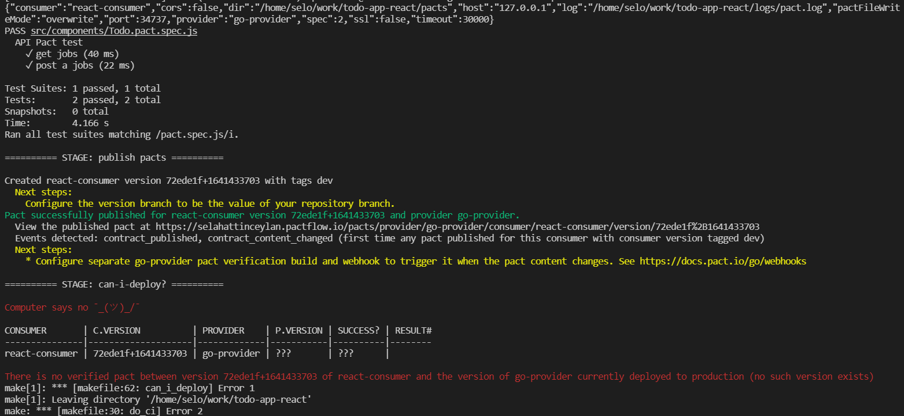
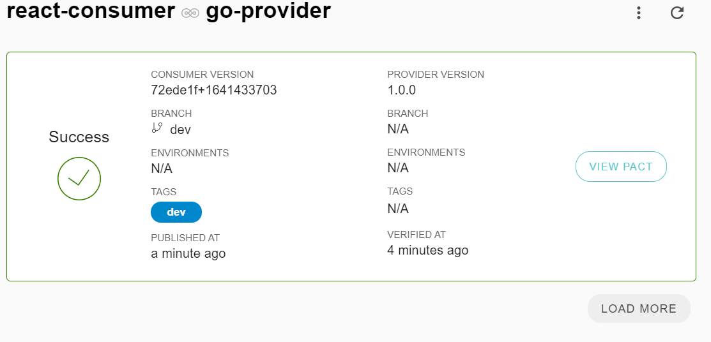

# todo-app-react

## For The General Project

I learned how to write tests and the logic of tests. I realized that the TDD part should actually be in every project. I have done the parts so far in about 2.5 days. I've read a lot of sources.

Maybe I could have done better if I had time to try a little harder. I am sending the project as it is because there are 2 important works/homework that I have to do.

```
├─ pacts                         //for saving pact files
├─ public                        //favicon.ico&index.html
├─ makefile                      //MakeFile 
└─ src                           //Front codes 
   ├─ components                 //Todo component and its test 
                                 // cases 

```

## ⚡️ Quick start


## Pre-Req
> npm i

## For build

```bash
npm run build
```
## For Test
I wrote the necessary test scenarios. These tests are unit tests and pact tests.
```bash
npm run test
```
## For test/publis pacts&test
```bash
make do_ci
```

## CI/CD Pipline
The ci/cd pipline part is working properly. If I have to explain the part I've done so far, the build,test and dockerize parts are working in multiple workflows.

#### A few images about pact tests




